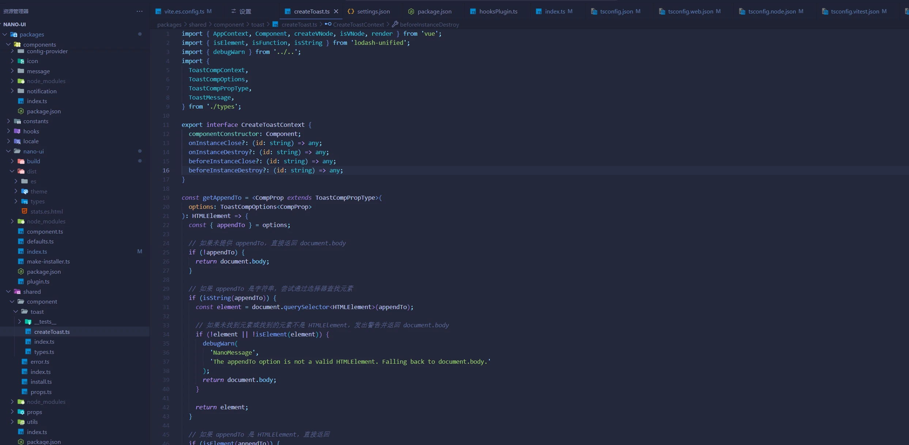
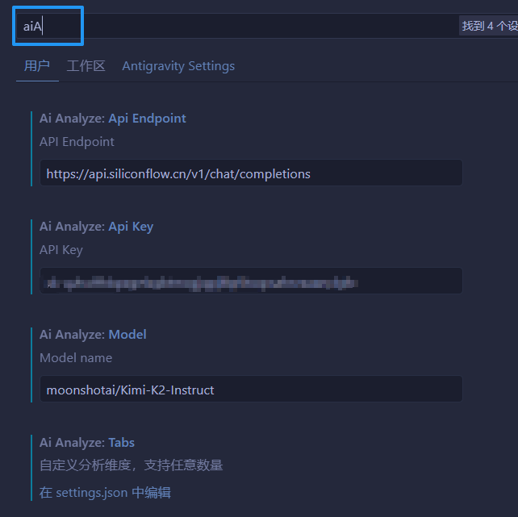
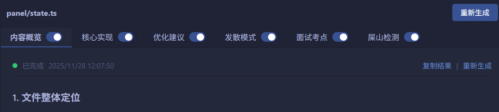

<div align="center">

# 🤖 AI Code Analyzer Panel

**为你的代码提供实时 AI 分析的 VS Code 扩展**

[](https://marketplace.visualstudio.com/items?itemName=huanxiaomang.hxm-ai-analyzer-panel)
[](https://marketplace.visualstudio.com/items?itemName=huanxiaomang.hxm-ai-analyzer-panel)
[](https://marketplace.visualstudio.com/items?itemName=huanxiaomang.hxm-ai-analyzer-panel)
[](https://github.com/huanxiaomang/vscode-ai-anaylsis-panel/blob/main/LICENSE)
[](https://github.com/huanxiaomang/vscode-ai-anaylsis-panel)

[English](README.md) | [简体中文](README.zh-CN.md)

</div>

---



## 📖 简介

AI Code Analyzer Panel 是一个强大的 VS Code 扩展，通过可自定义的多维度分析视图，为你的代码提供实时 AI 分析。帮助你更好地理解代码结构、发现潜在问题并获得优化建议。

实习过的肯定都知道，自己一个人看组内项目都很复杂很难懂，文件很多每次看一个文件都问一次 ai 不现实，这个插件正是解决这个问题，在看大型复杂项目快速浏览多个文件时，主动提高效率。

### ✨ 核心特性

<table>
<tr>
<td width="50%">

#### 🚀 智能分析

- **自动启动**: IDE 启动时自动打开分析面板
- **实时同步**: 切换文件时自动跟随更新
- **流式输出**: 实时显示 AI 分析结果

</td>
<td width="50%">

#### 🎯 高度可配置

- **多维度分析**: 自定义分析维度（概览、实现、优化等）
- **灵活配置**: 支持自定义 API、模型和提示词
- **智能缓存**: 分析结果持久化存储

</td>
</tr>
</table>

---

## 功能展示

### 主要功能

- 🔄 **实时同步**: 切换文件时，分析面板自动跟随更新
- 💾 **智能缓存**: 分析结果持久化存储，重启 IDE 后无需重新分析
- 📝 **多维度分析**: 支持自定义多个分析维度（概览、实现细节、优化建议等）
- 🎯 **右键快捷**: 文件树中右键即可启动 AI 分析
- ⚡ **流式输出**: 实时显示 AI 分析结果，无需等待
- 🔧 **高度可配置**: 支持自定义 API、模型和分析提示词

---

## 快速开始

### 安装

1. 打开 VS Code
2. 按 `Ctrl+Shift+X` 打开扩展面板
3. 搜索 `AI Code Analyzer Panel`
4. 点击 **安装**

## ⚙️ 配置指南

### 必需配置

在使用前，需要配置 AI 服务相关参数。打开 VS Code 设置（`Ctrl+,`），搜索 `AI Code Analyzer`：

#### 1. API Key (`aiAnalyze.apiKey`)

你的 OpenAI API Key 或兼容服务的 API Key

```json
"aiAnalyze.apiKey": "sk-xxx..."
```

#### 2. API Endpoint (`aiAnalyze.apiEndpoint`)

API 服务地址，默认为 OpenAI，也可使用其他兼容服务

```json
"aiAnalyze.apiEndpoint": "https://api.openai.com/v1/chat/completions"
```

#### 3. Model (`aiAnalyze.model`)

使用的 AI 模型

```json
"aiAnalyze.model": "gpt-4o-mini"
```



### 💡 推荐配置：使用硅基流动（免费）

[硅基流动](https://siliconflow.cn/) 提供免费的 API Key，可直接使用以下配置：

```json
{
  "aiAnalyze.model": "moonshotai/Kimi-K2-Instruct",
  "aiAnalyze.apiEndpoint": "https://api.siliconflow.cn/v1/chat/completions",
  "aiAnalyze.apiKey": "你的apiKey"
}
```

### 自定义分析维度

扩展默认提供三个分析维度，你可以在设置中自定义 `aiAnalyze.tabs`：

```json
{
  "aiAnalyze.tabs": [
    {
      "key": "summary",
      "title": "内容概览",
      "prompt": "分析这个文件的整体功能..."
    },
    {
      "key": "implementation",
      "title": "核心实现",
      "prompt": "详细说明这个文件的实现细节..."
    },
    {
      "key": "optimization",
      "title": "优化建议",
      "prompt": "提供代码优化建议..."
    }
  ]
}
```

数组的每一项分别对应一个 tab：



#### 提示词变量

在自定义提示词时，可以使用以下变量：

- `${fileName}`: 当前文件名
- `${codeContent}`: 当前文件完整代码

---

#### 推荐 prompt

待添加

## 📚 使用教程

### 方式一：右键菜单

1. 在文件资源管理器中找到要分析的文件
2. 右键点击文件
3. 选择 **"启动 AI 分析视图"**
4. 分析面板打开并开始分析该文件

### 方式二：命令面板

1. 按 `Ctrl+Shift+P`（Mac: `Cmd+Shift+P`）打开命令面板
2. 输入 `启动AI分析视图`
3. 回车执行

---

<div align="center">

**如果这个项目对你有帮助，请给它一个 ⭐️！**

Made with ❤️ by [huanxiaomang](https://github.com/huanxiaomang)

</div>
