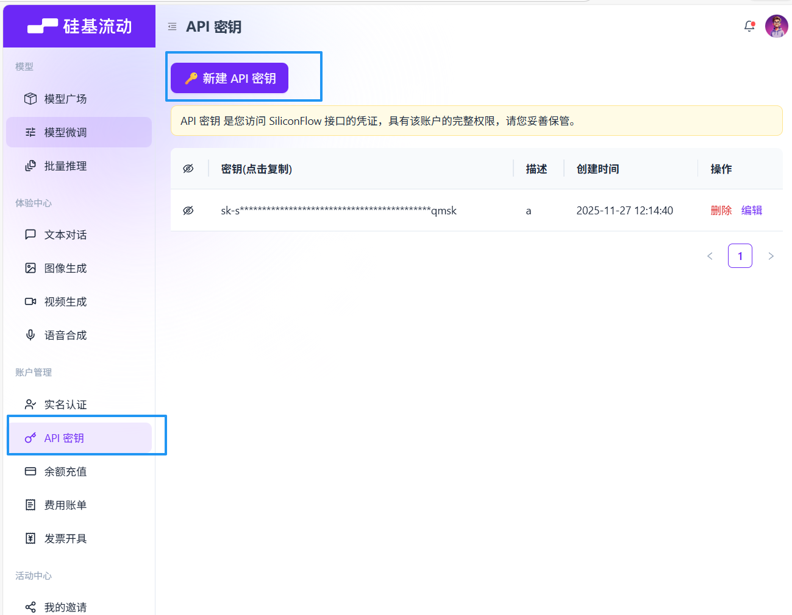
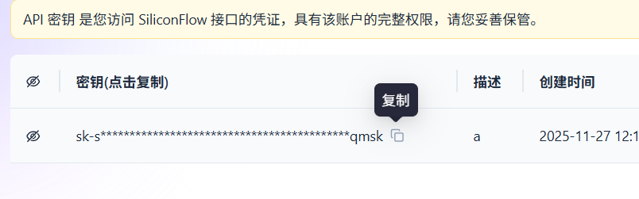
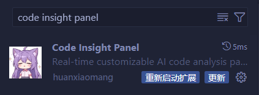
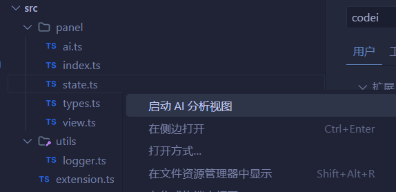

# 🍼 婴儿级图文教程

> 如果你觉得主教程太复杂，这里有一个超级简单的快速上手指南！

---

## 📝 步骤总览

1. 注册硅基流动账号
2. 获取 API Key
3. 安装 VS Code 插件
4. 配置插件
5. 开始使用

---

## 🚀 详细步骤

### 步骤 1: 注册硅基流动

访问硅基流动官网并注册账号：

🔗 **https://siliconflow.cn/**

### 步骤 2: 生成 API Key

登录后，进入控制台创建新的 API Key：

1. 点击「创建 API Key」
2. 输入密钥名称（随便取，比如 `vscode-plugin`）
3. 点击确认

### 步骤 3: 复制 API Key

生成后，点击复制按钮保存你的 API Key：

> ⚠️ **重要**: API Key 请妥善保管！

### 步骤 4: 安装插件

在 VS Code 中：

1. 按 `Ctrl+Shift+X` 打开扩展市场
2. 搜索 `Code Insight Panel`
3. 点击「安装」

### 步骤 5: 配置插件

安装完成后，按 `Ctrl+,` 打开设置，搜索 `code insight panel`：

#### 需要修改三个配置项：

| 配置项           | 值                                               |
| ---------------- | ------------------------------------------------ |
| **API Endpoint** | `https://api.siliconflow.cn/v1/chat/completions` |
| **API Key**      | 粘贴你刚才复制的 API Key                         |
| **Model name**   | `moonshotai/Kimi-K2-Instruct`                    |

### 步骤 6: 开始使用 🎉

配置完成！现在你可以：

1. 在文件管理器中右键点击任意代码文件
2. 选择「启动 AI 分析视图」

---

## ❓ 常见问题

<b>Q: 为什么选择硅基流动？</b>

A: 硅基流动提供免费的 API 额度，非常适合新手入门使用。

<b>Q: API Key 忘记了怎么办？</b>

A: 在硅基流动控制台重新生成一个新的 API Key 即可。

